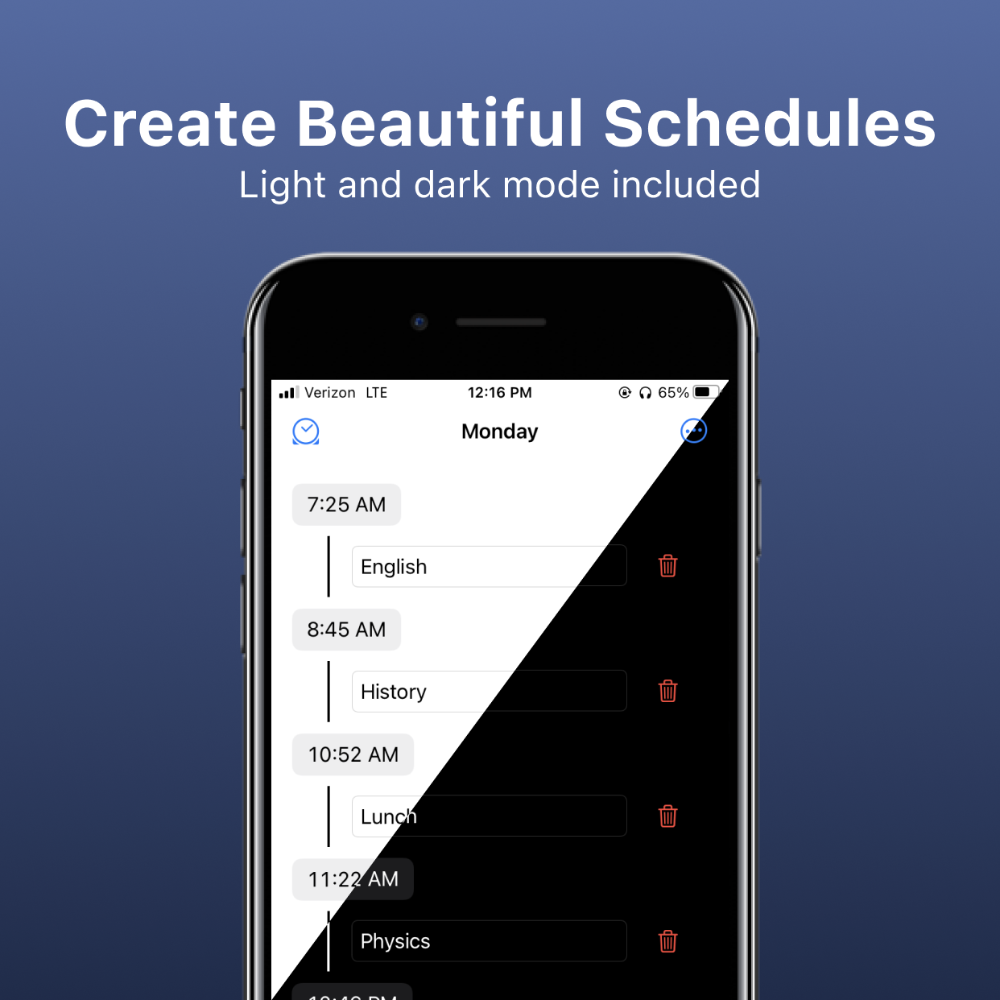
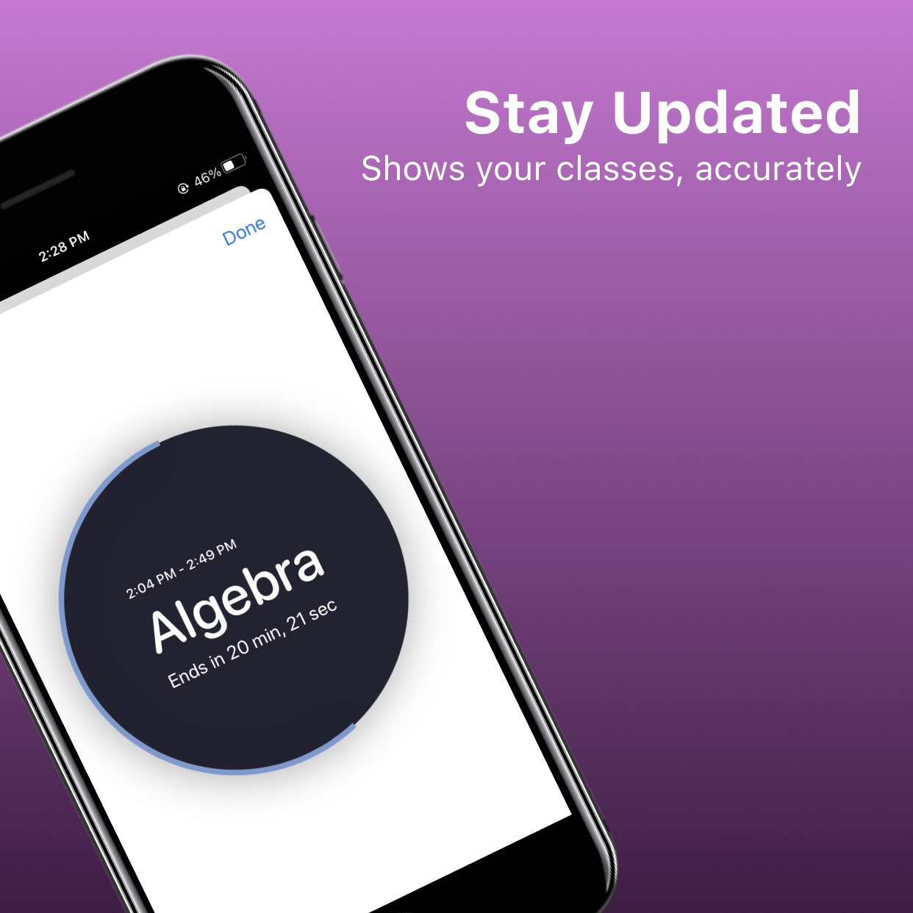
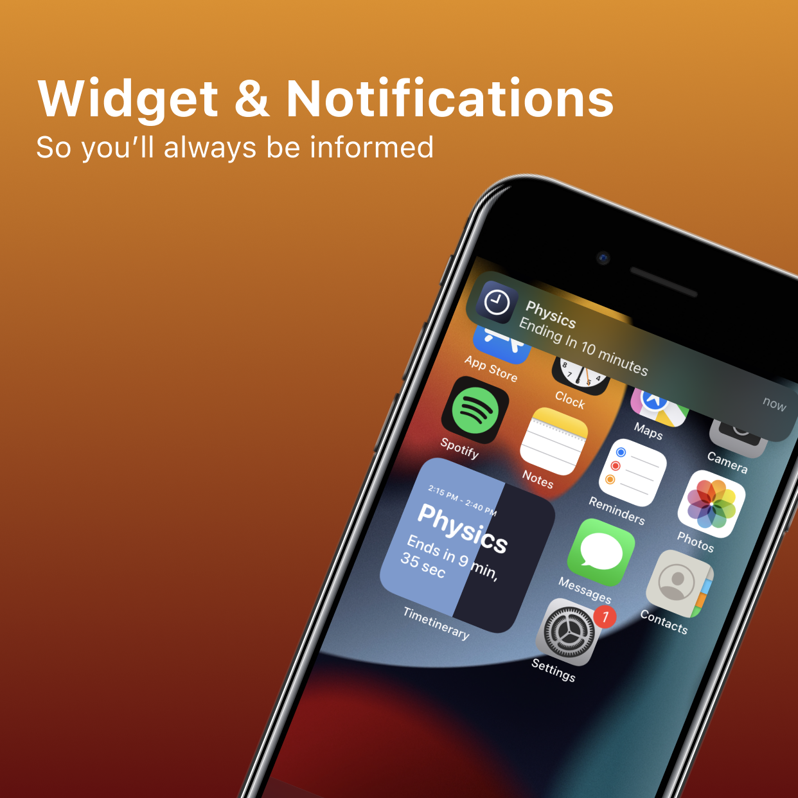
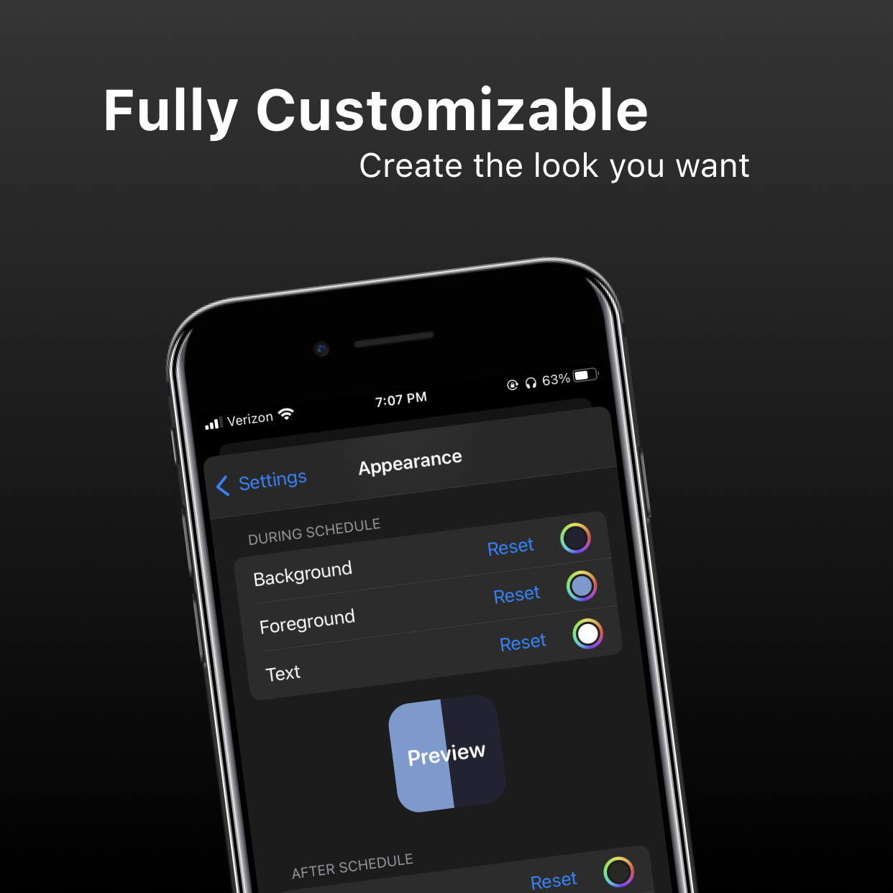

</a>
 
 

# Timetinerary

Timetinerary is an iOS app that allows you to create, save, and share continuous schedules. These schedules can be converted into a widget and notifications. Stay on top of your schedule with Timetinerary.

<a href="https://bit.ly/Timetinerary">**App Store**</a>

<a href="https://benkoppe.netlify.app/timetinerary/privacy-policy">**Privacy Policy**</a>
